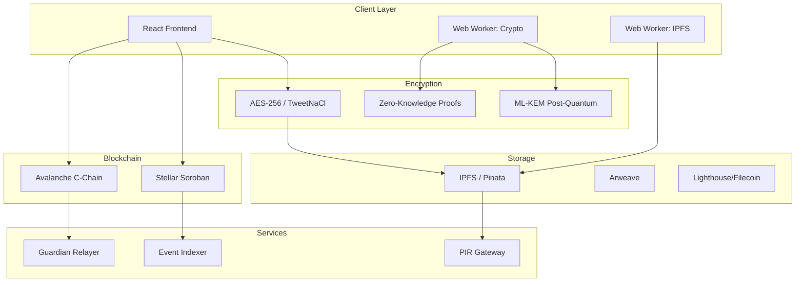

<div align="center">

# 🔐 ChainGuard

**Enterprise-Grade Decentralized Document Custody Platform**

[](https://opensource.org/licenses/MIT)
[](#)
[](https://www.typescriptlang.org/)
[](https://reactjs.org/)
[](https://vitejs.dev/)

[](https://www.avax.network/)
[](https://stellar.org/soroban)
[](https://ipfs.io/)

[](#-documentation)
[](#-community)
[](#-community)

---

**ChainGuard** is a multi-chain document custody application that combines zero-knowledge encryption, guardian-based multi-signature approvals, proof-of-life mechanisms, and NFT access passes to provide enterprise-grade security for sensitive documents.

[Get Started](#-quick-start) • [Documentation](#-documentation) • [Deploy](#-deployment) • [Contributing](#-contributing)

</div>

---

## 📋 Table of Contents

- [Features](#-features)
- [Architecture](#-architecture)
- [Quick Start](#-quick-start)
- [Installation](#-installation)
- [Configuration](#-configuration)
- [Development](#-development)
- [Testing](#-testing)
- [Deployment](#-deployment)
- [Tech Stack](#-tech-stack)
- [Project Structure](#-project-structure)
- [Documentation](#-documentation)
- [Contributing](#-contributing)
- [License](#-license)
- [Support](#-support)

---

## ✨ Features

### 🔗 Multi-Chain Support
- **Avalanche Fuji (EVM)**: Full Ethereum-compatible smart contracts
- **Stellar Soroban**: Rust-based smart contracts with native ABAP
- Seamless chain switching from the sidebar

### 🔒 Zero-Knowledge Encryption
- Client-side AES-256 and TweetNaCl encryption
- Documents never leave your device unencrypted
- ML-KEM post-quantum cryptography ready

### 👥 Guardian Multi-Sig
- Distribute access keys to trusted guardians
- Configurable threshold approval before document release
- Real-time guardian notifications via Push Protocol

### ⏰ Proof-of-Life & Dead-Man's Switch
- Automated document release on owner inactivity
- Unpredictable VRF/PRNG delay for emergency unlocks
- Web3 keeper integration (Chainlink/Gelato)

### 🎨 NFT Access Passes
- Tokenized authorization for vault access
- ERC-721 compliant on Avalanche
- Tradeable and transferable access rights

### 📦 IPFS Storage
- Decentralized, content-addressed storage
- Optional serverless proxy for API key security
- Multi-gateway fallback for reliability

### 🔍 Private Information Retrieval
- Oblivious document fetching with dummy queries
- Optional Tor proxy integration
- Gateway surveillance prevention

### 📊 Real-Time Events
- WebSocket-based Soroban event broadcasting
- Exponential backoff reconnection
- Live audit log updates

---

## 🏗 Architecture



---

## 🚀 Quick Start

### Prerequisites

| Requirement | Version | Purpose |
|-------------|---------|---------|
| Node.js | v18+ | Runtime environment |
| npm | v9+ | Package manager |
| MetaMask | Latest | Avalanche Fuji wallet |
| Freighter | Latest | Stellar wallet |

### 1-Minute Setup

```bash
# Clone the repository
git clone https://github.com/chainguard/chainguard.git
cd chainguard

# Install dependencies
npm install

# Copy environment template
cp .env.example .env

# Start development server
npm run dev
```

Open [http://localhost:3000](http://localhost:3000) in your browser.

---

## 📦 Installation

### From Source

```bash
# 1. Clone the repository
git clone https://github.com/chainguard/chainguard.git
cd chainguard

# 2. Install dependencies
npm install

# 3. Install Playwright browsers (for E2E tests)
npx playwright install chromium

# 4. Compile smart contracts
npx hardhat compile --config hardhat.config.cjs

# 5. Run the development server
npm run dev
```

### System Requirements

- **OS**: Windows 10+, macOS 10.15+, or Linux
- **RAM**: 4GB minimum, 8GB recommended
- **Storage**: 2GB free space
- **Network**: Internet connection required for blockchain interactions

---

## ⚙️ Configuration

### Environment Variables

Create a `.env` file in the root directory:

```env
# ===========================================
# CONTRACT CONFIGURATION
# ===========================================
VITE_CONTRACT_ADDRESS=0x64128680775Ef626379DeF6E5c815AeA8F4707Ef
VITE_STELLAR_CONTRACT_ADDRESS=your_stellar_contract_address
VITE_CHAIN_ID=43113

# ===========================================
# NETWORK CONFIGURATION
# ===========================================
VITE_AVALANCHE_RPC=https://api.avax-test.network/ext/bc/C/rpc
VITE_CHAIN_NAME=Avalanche Fuji Testnet

# ===========================================
# IPFS CONFIGURATION
# ===========================================
VITE_IPFS_GATEWAY=https://gateway.pinata.cloud/ipfs/
VITE_PINATA_API_KEY=your_pinata_api_key
VITE_PINATA_API_SECRET=your_pinata_api_secret
VITE_PINATA_JWT=your_pinata_jwt

# Optional: IPFS Proxy (recommended for production)
# VITE_IPFS_PROXY_URL=http://localhost:3001
# VITE_CHAINGUARD_PROXY_SECRET=your_proxy_secret

# Optional: Fallback gateways
# VITE_IPFS_FALLBACK_GATEWAYS=https://gateway1/ipfs/,https://gateway2/ipfs/

# ===========================================
# SECURITY CONFIGURATION
# ===========================================
# VITE_PIR_ENABLED=true
# VITE_PIR_USE_TOR=false
# VITE_OPAQUE_SERVER_URL=http://localhost:3010
```

### Required API Keys

| Service | Purpose | Get Key |
|---------|---------|---------|
| Pinata | IPFS Storage | [pinata.cloud](https://app.pinata.cloud/developers/api-keys) |
| Optional: Push Protocol | Notifications | [push.org](https://comms.push.org/) |
| Optional: Lighthouse | Filecoin Backup | [lighthouse.storage](https://www.lighthouse.storage/) |

---

## 🛠 Development

### Available Scripts

```bash
# Development
npm run dev              # Start Vite dev server
npm run build            # Build for production
npm run preview          # Preview production build

# Testing
npm test                 # Run unit tests
npm run test:smoke       # Run smoke tests
npm run test:contracts   # Run Hardhat contract tests
npm run test:stellar     # Run Stellar Soroban tests
npm run test:relayer     # Run guardian relayer tests

# E2E Testing
npm run e2e:install      # Install Playwright browsers
npm run e2e:evm          # Run EVM E2E tests
npm run e2e:stellar      # Run Stellar E2E tests

# Smart Contracts
npm run deploy:contract  # Deploy to Avalanche Fuji
npm run test:contracts   # Run contract tests with gas reporter

# Services
npm run proxy:pinata     # Start IPFS proxy server
npm run server:opaque    # Start OPAQUE keyring server
npm run gateway:soroban  # Start Soroban event gateway
npm run relayer          # Start guardian notification relayer
```

### Code Quality

```bash
# Type checking
npx tsc --noEmit

# Linting (if configured)
npm run lint

# Format code (if configured)
npm run format
```

---

## 🧪 Testing

### Test Types

| Type | Command | Coverage |
|------|---------|----------|
| Unit Tests | `npm test` | Component & service tests |
| Contract Tests | `npm run test:contracts` | Solidity smart contracts |
| Stellar Tests | `npm run test:stellar` | Soroban Rust contracts |
| E2E Tests | `npm run e2e:evm` | Full user workflows |
| Smoke Tests | `npm run test:smoke` | Critical path validation |

### Running Specific Tests

```bash
# Run tests with coverage
npx vitest run --coverage

# Run tests in watch mode
npx vitest

# Run specific test file
npx vitest run path/to/test.ts

# Run Hardhat tests with gas reporting
REPORT_GAS=true npx hardhat test --config hardhat.config.cjs
```

---

## 🚀 Deployment

### Firebase Hosting

```bash
# Install Firebase CLI
npm install -g firebase-tools

# Login to Firebase
firebase login

# Deploy
npm run build
firebase deploy
```

### Docker

```bash
# Build image
docker build -t chainguard .

# Run container
docker run -p 3000:3000 chainguard
```

### Manual Deployment

```bash
# Build for production
npm run build

# The dist/ folder is ready for deployment
# Upload to any static hosting service
```

---

## 🧰 Tech Stack

### Frontend
| Technology | Purpose |
|------------|---------|
| React 18 | UI framework |
| TypeScript 5 | Type safety |
| Vite 5 | Build tool |
| Tailwind CSS | Styling |
| HeroUI | Component library |
| React Router | Navigation |
| Zustand | State management |
| Framer Motion | Animations |

### Blockchain
| Technology | Purpose |
|------------|---------|
| Solidity | EVM smart contracts |
| Rust/Soroban | Stellar smart contracts |
| ethers.js | Ethereum interaction |
| Stellar SDK | Stellar interaction |
| OpenZeppelin | Contract security |

### Security
| Technology | Purpose |
|------------|---------|
| TweetNaCl | Encryption |
| ML-KEM | Post-quantum crypto |
| OPAQUE | Password verification |
| BLS Signatures | Threshold signatures |
| VDF | Verifiable delay functions |

### Storage
| Technology | Purpose |
|------------|---------|
| IPFS | Decentralized storage |
| Pinata | IPFS pinning |
| Arweave | Permanent storage |
| Filecoin | Backup storage |

### Testing
| Technology | Purpose |
|------------|---------|
| Vitest | Unit testing |
| Hardhat | Contract testing |
| Playwright | E2E testing |
| Echidna | Fuzzing |

---

## 📁 Project Structure

```
chainguard/
├── 📁 contracts/              # Solidity smart contracts (EVM)
├── 📁 contracts-stellar/      # Rust smart contracts (Stellar)
├── 📁 docs/                   # Documentation
├── 📁 scripts/                # Deployment & utility scripts
├── 📁 e2e/                    # End-to-end tests
├── 📁 relayer/                # Guardian notification relayer
├── 📁 circuits/               # Zero-knowledge circuits
├── 📁 fuzz/                   # Fuzzing configurations
├── 📁 public/                 # Static assets
├── 📁 src/
│   ├── 📁 features/           # Feature-based modules
│   │   ├── 📁 auth/           # Authentication & key management
│   │   ├── 📁 blockchain/     # Multi-chain support
│   │   ├── 📁 documents/      # Document management
│   │   ├── 📁 guardian/       # Guardian approvals
│   │   ├── 📁 nft/            # NFT access passes
│   │   └── 📁 vault/          # Vault management
│   ├── 📁 shared/             # Shared utilities & components
│   ├── 📁 core/               # Core infrastructure
│   │   ├── 📁 crypto/         # Cryptographic services
│   │   └── 📁 storage/        # Storage services
│   ├── 📁 context/            # React context
│   ├── 📁 layouts/            # Layout components
│   ├── 📁 styles/             # CSS/styling
│   └── 📁 workers/            # Web workers
├── 📄 .env.example            # Environment template
├── 📄 package.json            # Dependencies
├── 📄 tsconfig.json           # TypeScript config
├── 📄 vite.config.ts          # Vite config
├── 📄 STRUCTURE.md            # Architecture docs
└── 📄 README.md               # This file
```

---

## 📚 Documentation

| Document | Description |
|----------|-------------|
| [STRUCTURE.md](STRUCTURE.md) | Architecture & code organization |
| [CONTRIBUTING.md](CONTRIBUTING.md) | Contribution guidelines |
| [SECURITY.md](SECURITY.md) | Security policy & reporting |
| [docs/ARCHITECTURE.md](docs/ARCHITECTURE.md) | System architecture |
| [docs/TESTING.md](docs/TESTING.md) | Testing strategies |
| [docs/PIR_ARCHITECTURE.md](docs/PIR_ARCHITECTURE.md) | Private Information Retrieval |
| [docs/OPAQUE_KEYRING.md](docs/OPAQUE_KEYRING.md) | OPAQUE PIN verification |
| [docs/HEARTBEAT_RELAYER.md](docs/HEARTBEAT_RELAYER.md) | Heartbeat relay system |

---

## 🤝 Contributing

We welcome contributions! Please see our [Contributing Guidelines](CONTRIBUTING.md) for details.

### How to Contribute

1. **Fork** the repository
2. **Create** a feature branch (`git checkout -b feature/amazing-feature`)
3. **Commit** your changes (`git commit -m 'Add amazing feature'`)
4. **Push** to the branch (`git push origin feature/amazing-feature`)
5. **Open** a Pull Request

### Development Setup

```bash
# Fork and clone
git clone https://github.com/your-username/chainguard.git
cd chainguard

# Install dependencies
npm install

# Create feature branch
git checkout -b feature/your-feature

# Start development
npm run dev
```

### Code Standards

- Follow TypeScript best practices
- Write tests for new features
- Update documentation as needed
- Use conventional commit messages

---

## 📄 License

This project is licensed under the **MIT License** - see the [LICENSE](LICENSE) file for details.

```
MIT License

Copyright (c) 2026 ChainGuard Contributors

Permission is hereby granted, free of charge, to any person obtaining a copy
of this software and associated documentation files (the "Software"), to deal
in the Software without restriction, including without limitation the rights
to use, copy, modify, merge, publish, distribute, sublicense, and/or sell
copies of the Software, and to permit persons to whom the Software is
furnished to do so, subject to the following conditions:

The above copyright notice and this permission notice shall be included in all
copies or substantial portions of the Software.

THE SOFTWARE IS PROVIDED "AS IS", WITHOUT WARRANTY OF ANY KIND, EXPRESS OR
IMPLIED, INCLUDING BUT NOT LIMITED TO THE WARRANTIES OF MERCHANTABILITY,
FITNESS FOR A PARTICULAR PURPOSE AND NONINFRINGEMENT. IN NO EVENT SHALL THE
AUTHORS OR COPYRIGHT HOLDERS BE LIABLE FOR ANY CLAIM, DAMAGES OR OTHER
LIABILITY, WHETHER IN AN ACTION OF CONTRACT, TORT OR OTHERWISE, ARISING FROM,
OUT OF OR IN CONNECTION WITH THE SOFTWARE OR THE USE OR OTHER DEALINGS IN THE
SOFTWARE.
```

---

## 💬 Support

### Get Help

| Channel | Purpose |
|---------|---------|
| [GitHub Issues](https://github.com/chainguard/chainguard/issues) | Bug reports & feature requests |
| [Discord](#) | Community chat |
| [Twitter](#) | Updates & announcements |

### Security Issues

If you discover a security vulnerability, please report it responsibly:

1. **DO NOT** open a public issue
2. Email security@chainguard.io (placeholder)
3. Include detailed reproduction steps
4. Allow 48 hours for initial response

---

## 🙏 Acknowledgments

- [Avalanche](https://www.avax.network/) - EVM blockchain
- [Stellar](https://stellar.org/) - Soroban smart contracts
- [IPFS](https://ipfs.io/) - Decentralized storage
- [OpenZeppelin](https://www.openzeppelin.com/) - Smart contract security
- [React](https://reactjs.org/) - UI framework
- [Vite](https://vitejs.dev/) - Build tool

---

<div align="center">

**Built with ❤️ by the ChainGuard Team**

[Back to Top](#-chainguard)

</div>
